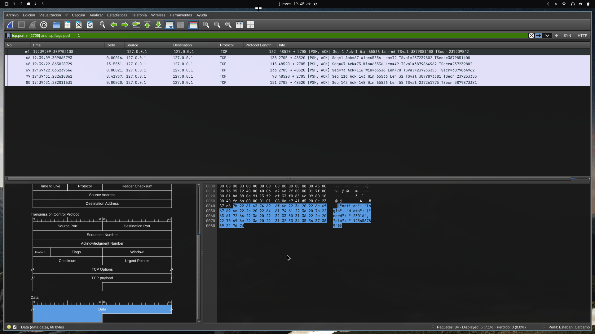
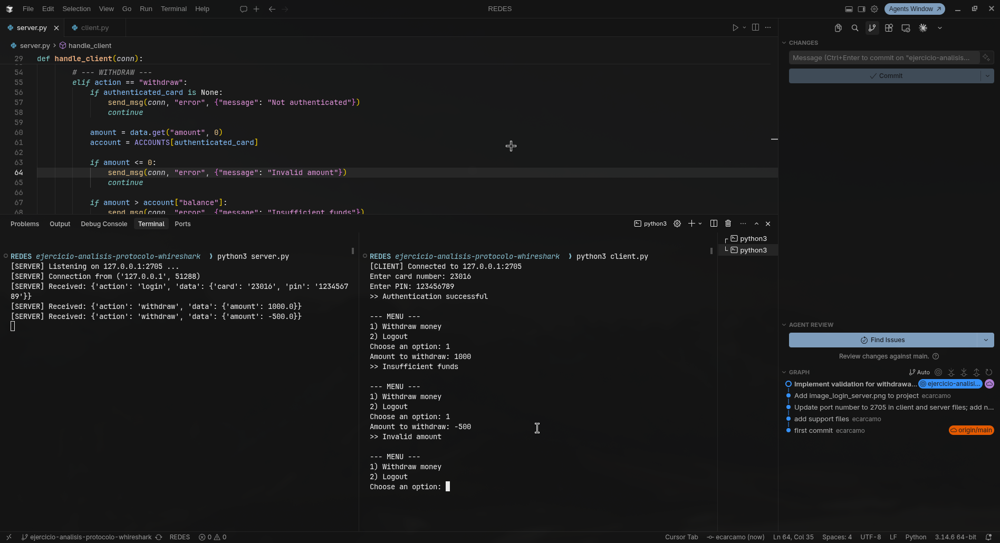
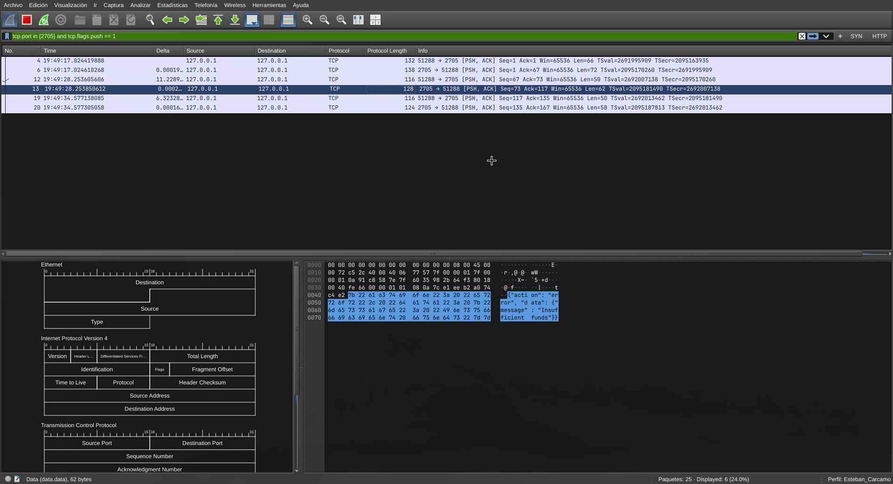
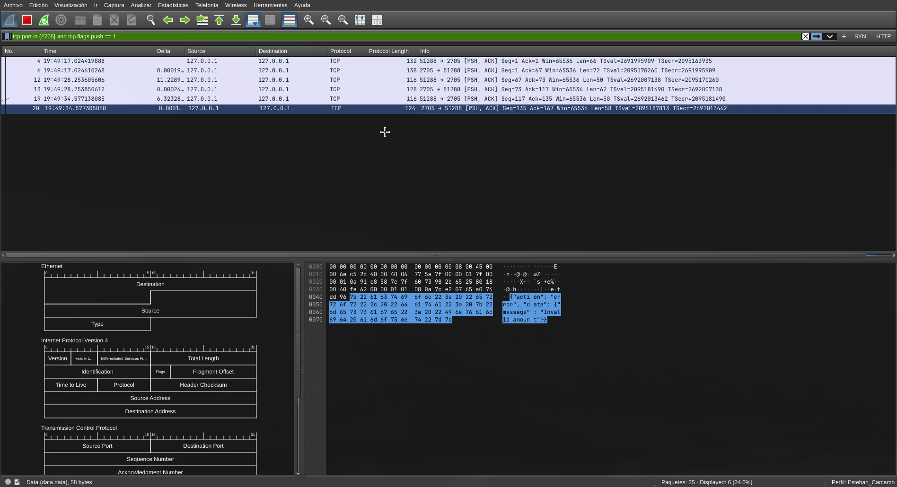

# Ejercicio: Análisis de Protocolo de Capa de Aplicación con Wireshark

## Descripción

Este ejercicio simula la comunicación entre un cajero automático (`client.py`) y el servidor de un banco (`server.py`) mediante un protocolo propio construido sobre TCP, con mensajes serializados en JSON. El objetivo es capturar y analizar dicho tráfico con Wireshark, identificando cómo viajan las credenciales y los mensajes de la aplicación en texto plano, y luego corregir una vulnerabilidad en la lógica de retiro de dinero.

## Archivos

- `server.py`: servidor que maneja login, retiro (withdraw) y logout.
- `client.py`: cliente que se conecta al servidor, autentica al usuario y permite operar sobre la cuenta.
- `tcp_protocol.pcapng`: captura de tráfico realizada con Wireshark sobre la interfaz Loopback (`lo`).
- `images/`: capturas de pantalla que evidencian el análisis.

## Configuración utilizada

- **Host:** `127.0.0.1` (loopback, misma máquina)
- **Puerto:** `2705`
- **Cuenta agregada:** carnet `23016`, PIN `123456789`, saldo inicial `$400.00`

## Procedimiento

1. Se agregó la cuenta con carnet, PIN y saldo en `ACCOUNTS` dentro de `server.py`, y se actualizó el puerto (`PORT = 2705`) tanto en `server.py` como en `client.py`.
2. Se inició una captura de Wireshark en la interfaz **Loopback (`lo`)**.
3. Se ejecutó primero `server.py` y luego `client.py`, realizando login, un retiro menor al saldo disponible, y logout.
4. Se detuvo la captura y se configuró el layout de Wireshark con los tres paneles requeridos: **Packet List**, **Packet Diagram** y **Packet Bytes**.
5. Se aplicó el filtro:
   ```
   tcp.port in {2705} and tcp.flags.push==1
   ```
   para aislar únicamente los paquetes TCP con datos de aplicación (bandera **PSH**), descartando el handshake y los ACKs vacíos.
6. Se identificó el mensaje de **login**, exponiendo el carnet y PIN enviados en texto plano.

   

   *En el panel de Packet Bytes se observa el JSON `{"action": "login", "data": {"card": "23016", "pin": "123456789"}}`, viajando sin ningún tipo de cifrado.*

7. Se detectó que `server.py` no validaba que el monto a retirar fuera menor o igual al saldo disponible. Se corrigió agregando dos validaciones en la acción `withdraw`:
   - Si `amount <= 0` → se responde con el error `"Invalid amount"`.
   - Si `amount > balance` → se responde con el error `"Insufficient funds"`.

   En ambos casos el saldo no se modifica y no se aprueba el retiro.

8. Se repitió el procedimiento completo con una **nueva captura**, iniciando servidor y cliente, y esta vez se intentó un retiro **mayor al saldo disponible** y otro con un **monto inválido (negativo)**, para verificar que el servidor rechazara ambos casos correctamente.

   

   *Se observa el flujo completo: login exitoso, intento de retiro de $1000 (mayor al saldo de $400) rechazado con "Insufficient funds", e intento de retiro de -$500 rechazado con "Invalid amount".*

   

   *Con el mismo filtro aplicado, el panel de Packet Bytes muestra el mensaje `{"action": "error", "data": {"message": "Insufficient funds"}}` devuelto por el servidor.*

   

   *De forma similar, se captura el mensaje `{"action": "error", "data": {"message": "Invalid amount"}}` cuando se envía un monto negativo.*

## Conclusiones

- El protocolo transmite toda la información (credenciales, montos, saldos) **en texto plano** dentro de la capa de aplicación, sin cifrado. Cualquiera con acceso a la red o a la interfaz de captura puede leer el carnet y el PIN del usuario, lo cual sería inaceptable en un sistema bancario real (debería usarse TLS/SSL como mínimo).
- La bandera TCP **PSH** permite filtrar rápidamente los paquetes que contienen datos de la aplicación, facilitando el análisis y separando el "ruido" del handshake y los ACKs.
- La falta de validación de fondos en el servidor original permitía retiros por montos mayores al saldo disponible (e incluso montos negativos), lo cual fue corregido agregando las verificaciones correspondientes antes de procesar el retiro.