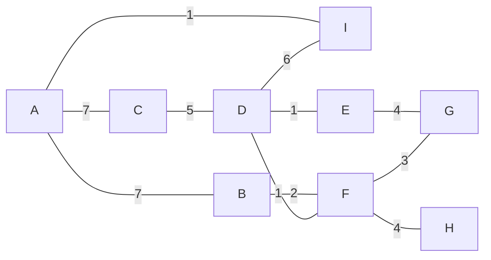

# Laboratorio 3 — Protocolos de enrutamiento

**CC3067 Redes — Universidad del Valle de Guatemala**
Esteban Cárcamo (23016) · Jorge Luis Felipe Aguilar (23195)

Implementación del protocolo **Link State** sobre una red simulada de nueve
nodos que se comunican por sockets TCP. Cada nodo es un proceso independiente
que descubre a sus vecinos con paquetes HELLO, inunda su LSA por la red, arma el
grafo completo y calcula sus rutas más cortas para escribir su tabla de
enrutamiento. Sobre esa tabla viaja el tráfico entre un cajero automático y un
servidor bancario, protegido con Hamming(7,4).

La topología y el formato de los mensajes están acordados con las otras dos
parejas del grupo, de modo que las tres implementaciones interoperan. El detalle
está en [docs/PROTOCOLO.md](docs/PROTOCOLO.md).

## Requisitos

Python 3.11 o superior. El nodo usa solo biblioteca estándar; `pytest` hace
falta únicamente para correr las pruebas.

```bash
make instalar        # crea .venv e instala las dependencias
```

O a mano, sin `make`:

```bash
python3 -m venv .venv && source .venv/bin/activate
pip install -r requirements.txt
```

## Cómo se ejecuta

Un nodo por terminal:

```bash
python3 nodo.py --id A
```

Los nueve nodos de la topología de una sola vez, cada uno con su bitácora en
`bitacoras/`:

```bash
make topologia
tail -f bitacoras/A.log
```

Opciones de `nodo.py`:

| Opción | Para qué sirve |
|---|---|
| `--id` | Identificador del nodo (`A` … `I`). Obligatorio. |
| `--topologia` | Ruta del archivo de vecinos y costos. Por defecto `config/topologia.json`. |
| `--nombres` | Ruta del archivo de direcciones. Por defecto `config/nombres.json`. |
| `--detallado` | Bitácora con el detalle de cada mensaje recibido y reenviado. |

## Configuración

Un nodo arranca conociendo solo dos cosas y aprende el resto por la red:

- `config/topologia.json` — sus vecinos con el costo de cada enlace. Los costos
  no se miden, se leen de aquí y son simétricos.
- `config/nombres.json` — en qué IP y puerto escucha cada nodo, y qué equipo
  terminal (ATM o banco) cuelga de él.

El repositorio trae la configuración apuntando a `127.0.0.1` para trabajar en
una sola máquina. **Para las pruebas sobre Tailscale solo hay que cambiar las
IP de `config/nombres.json`** por las direcciones `100.x.y.z` de cada
integrante; ni el código ni la topología cambian.

## Topología

Los nueve nodos y los once enlaces acordados:



| Enlace | Costo | Enlace | Costo |
|---|---|---|---|
| A–B | 7 | D–E | 1 |
| A–C | 7 | D–F | 1 |
| A–I | 1 | D–I | 6 |
| B–F | 2 | E–G | 4 |
| C–D | 5 | F–G | 3 |
| | | F–H | 4 |

El ATM cuelga del nodo **A** y el servidor bancario del nodo **E**; ninguno de
los dos es router.

## Estructura

```
config/           topología compartida y direcciones de cada nodo
protocolo/        formato de los mensajes y codec Hamming(7,4)
transporte/       sockets: escucha, enlaces con vecinos y delimitación de tramas
control/          plano de routing: HELLO, LSDB, flooding, Dijkstra y tabla CSV
datos/            plano de forwarding: reenvío según la tabla
endpoints/        cajero automático y servidor bancario
pruebas/          pruebas unitarias
nodo.py           proceso del router
```

## Pruebas

```bash
make pruebas      # o: python3 -m pytest -q
```

## Estado

La **primera mitad** está implementada y probada: configuración, Hamming(7,4),
formato de mensajes, capa de sockets y el plano de control completo (HELLO,
detección de caídas, LSDB, flooding y construcción del grafo). Levantando los
nueve nodos, todos convergen al mismo grafo de once enlaces, y al tumbar uno sus
vecinos emiten un LSA sin ese enlace y la red reconverge.

Queda pendiente la **segunda mitad**: el cálculo de rutas con Dijkstra, la
escritura y lectura de `<nodo>_tabla_enrutamiento.csv`, el plano de datos y los
dos equipos terminales. Las interfaces ya están fijadas y documentadas en
`control/dijkstra.py`, `control/tabla.py`, `datos/reenvio.py` y `endpoints/`.
