# Laboratorio #1 – Parte 2: Introducción a Wireshark

**Nombre:** Esteban Cárcamo
**Carnet:** 23016

## Introducción

Este reporte documenta la Parte 2 (individual) del Laboratorio #1 de CC3067 - Redes: introducción al analizador de paquetes Wireshark. Se personalizó el entorno de trabajo (perfil, columnas, colores, filtros y disposición de paneles), se configuró una captura con buffer cíclico (ring buffer) para gestionar el tamaño de los archivos generados, y se analizó una transacción HTTP real capturada al acceder a un sitio de prueba, con el fin de identificar información de protocolo relevante (versiones, encabezados, tamaño de contenido) y reflexionar sobre buenas prácticas de monitoreo de red.

## Entorno

- SO: CachyOS (Arch-based) con Hyprland
- Wireshark 4.7.1 (instalado vía pacman, `wireshark-qt`)
- Usuario agregado al grupo `wireshark`
- Permisos de `dumpcap` configurados (`cap_dac_override,cap_net_admin,cap_net_raw=eip`)

## 3.4 Personalización del entorno

### Perfil de configuración

Se creó el perfil `Esteban_Carcamo` (Edit -> Configuration Profiles -> `+`), confirmado en la esquina inferior derecha de Wireshark ("Perfil: Esteban_Carcamo").

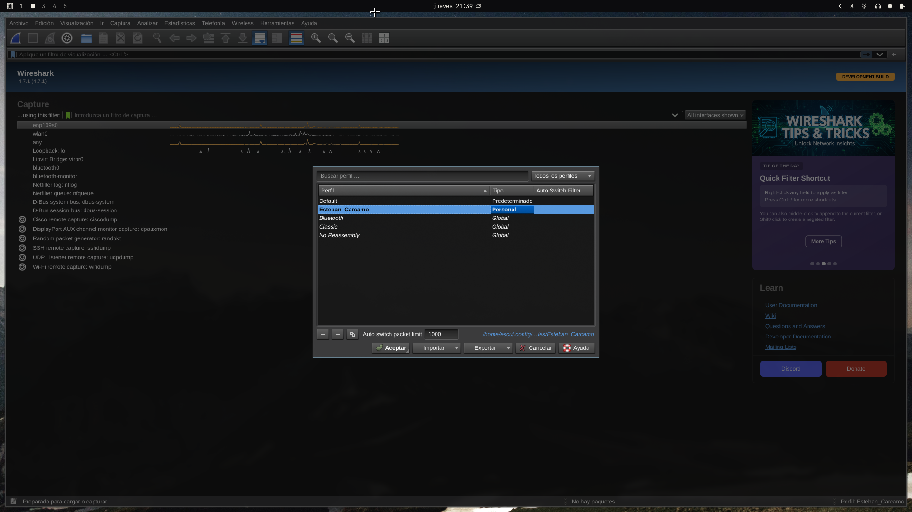

### Apertura de intro-wireshark-trace1.pcap

Se abrió el archivo `intro-wireshark-trace1.pcap` (651 paquetes) con el perfil `Esteban_Carcamo` activo.

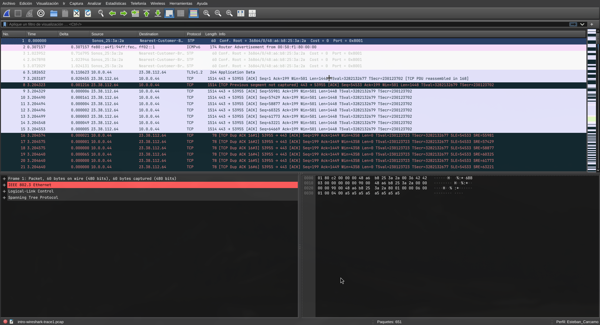

### Formato de tiempo (Time of Day)

Se aplicó `View -> Time Display Format -> Time of Day` (Hora de día, `Ctrl+Alt+2`). La columna Time pasó de mostrar segundos relativos a la hora del reloj (ej. `13:22:45.438793`).

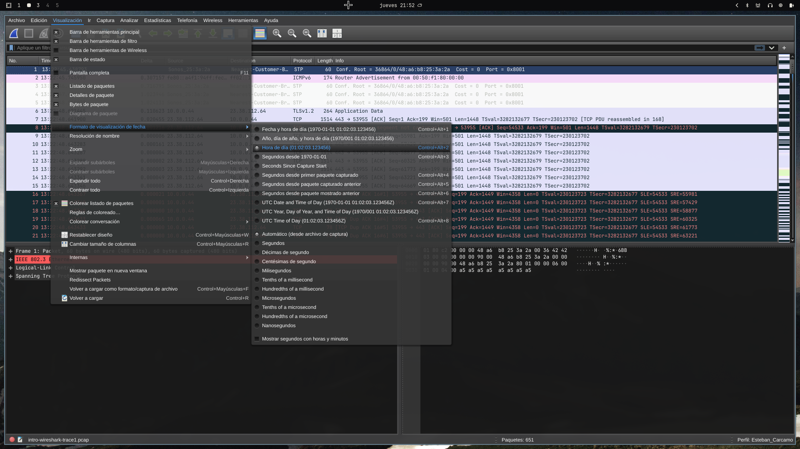
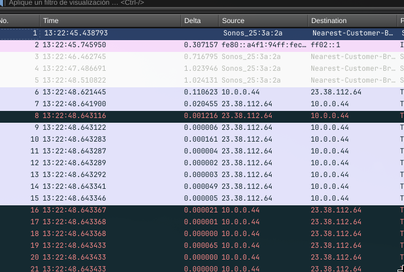

### Columna de longitud del protocolo

Se agregó una columna personalizada `Protocol Length` (Preferencias -> Apariencia -> Columnas -> `+`), tipo `Custom` con expresión `frame.len`.

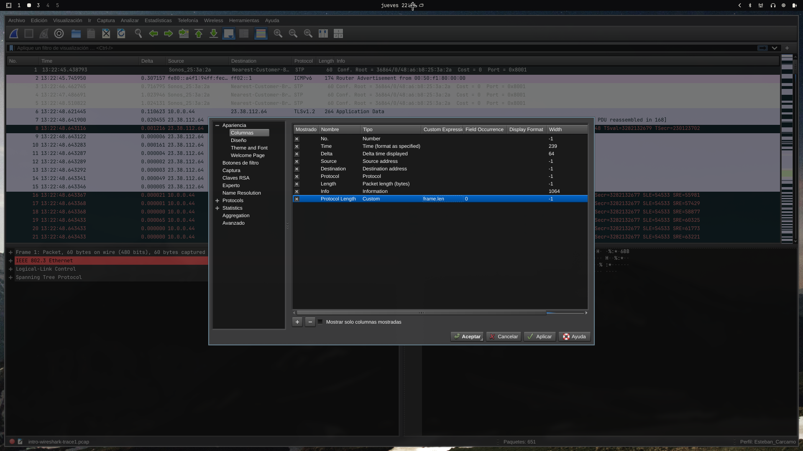
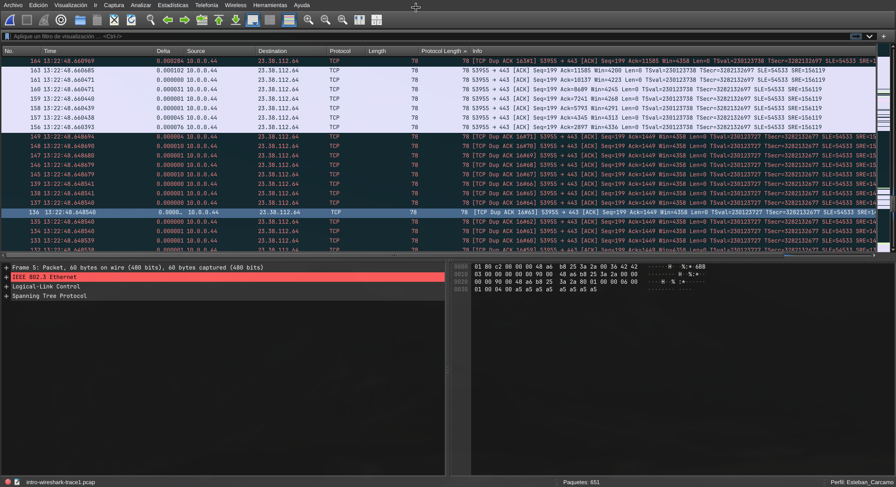

### Columna "Longitud" oculta/eliminada

Se desmarcó el checkbox "Mostrado" de la columna `Length` en Preferencias de Columnas, dejando visible únicamente `Protocol Length`.

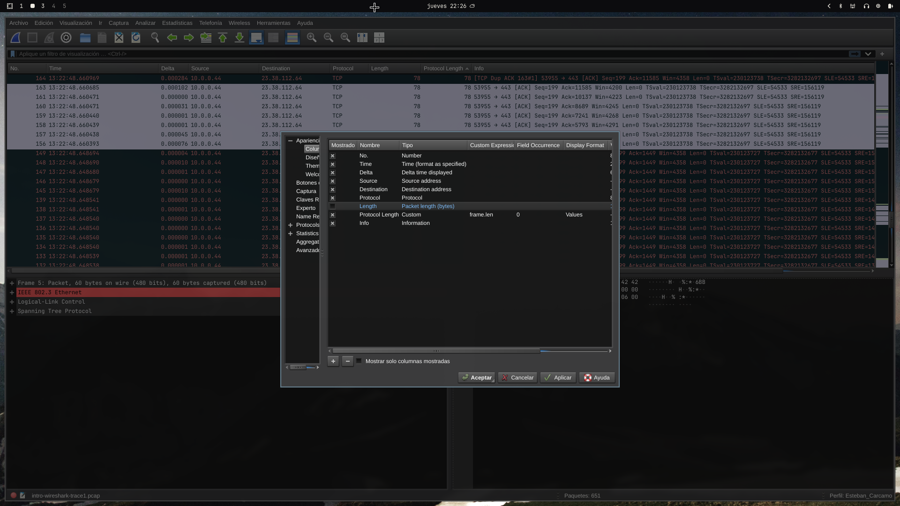
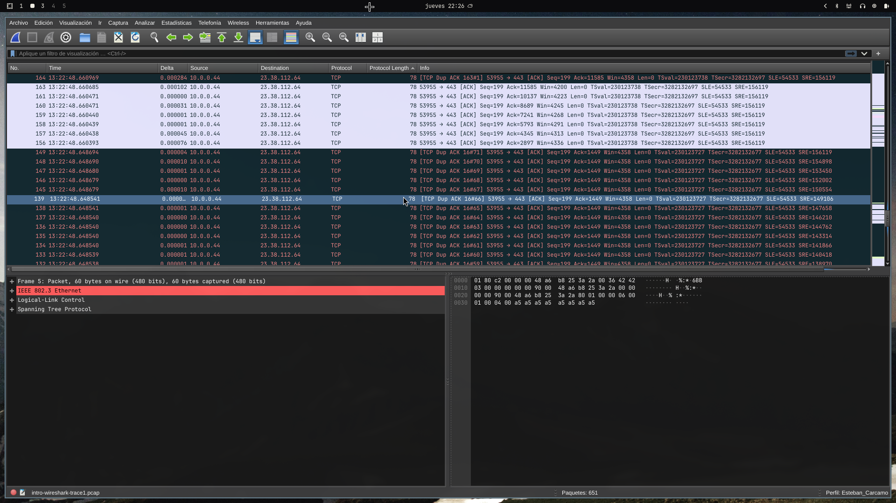

### Esquema de paneles personalizado

Se cambió el layout (Preferencias -> Apariencia -> Diseño) a una disposición con el listado de paquetes ocupando toda la columna izquierda, y los paneles de detalles y bytes apilados en la columna derecha, distinto al esquema por defecto.

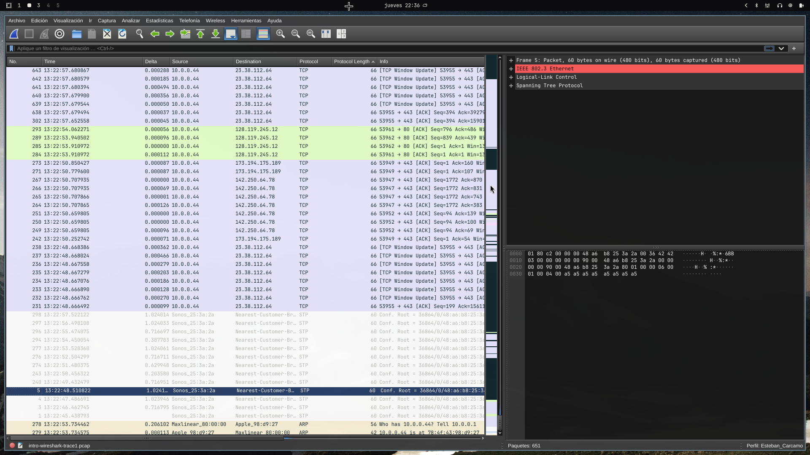

### Regla de color TCP SYN=1

Se creó la regla `REGLA NUEVA TCP` (View -> Coloring Rules -> `+`) con el filtro `tcp.flags.syn == 1`, con un color distintivo que resalta los paquetes SYN del handshake TCP en el listado.

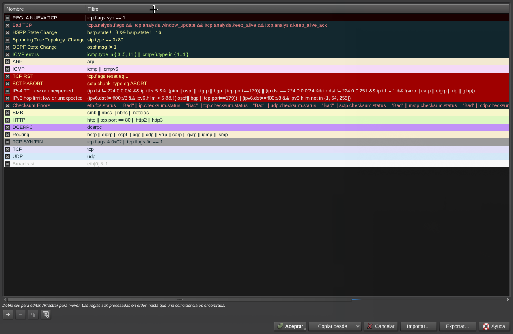
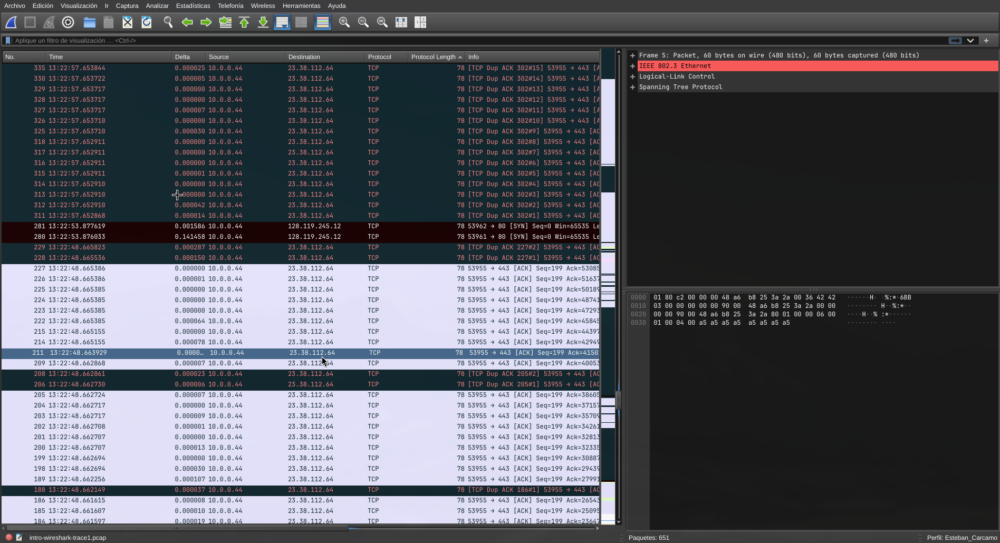

### Botón de filtro rápido TCP SYN=1

Se aplicó el filtro `tcp.flags.syn == 1` (mostrando 4 de 651 paquetes: los SYN y SYN-ACK del handshake) y se guardó como botón `SYN` en la barra de filtros.

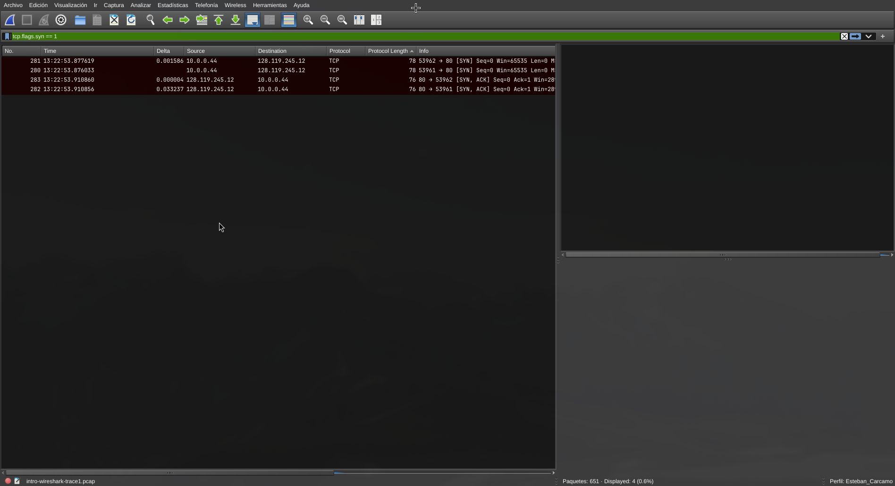
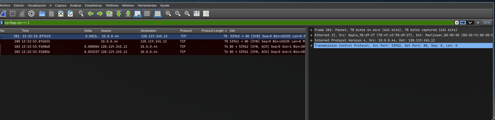
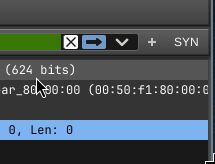

### Interfaces virtuales ocultas

Se ocultaron todas las interfaces virtuales/remotas (Loopback, Libvirt Bridge, Docker Bridge, Bridges, bluetooth, Netfilter, D-Bus, capturas remotas) dejando visibles únicamente `enp109s0` (Ethernet) y `wlan0` (WiFi). Wireshark confirma "2 interfaces shown, 18 hidden".

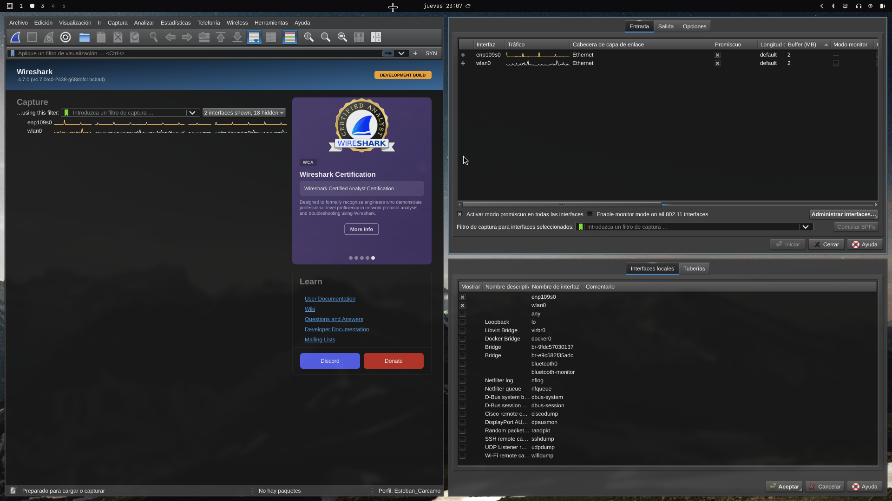

## 3.5 Configuración de la captura de paquetes (ring buffer)

### Salida de `ip a`

Se ejecutó `ip a` (equivalente moderno de `ifconfig` en Linux) para listar las interfaces de red:

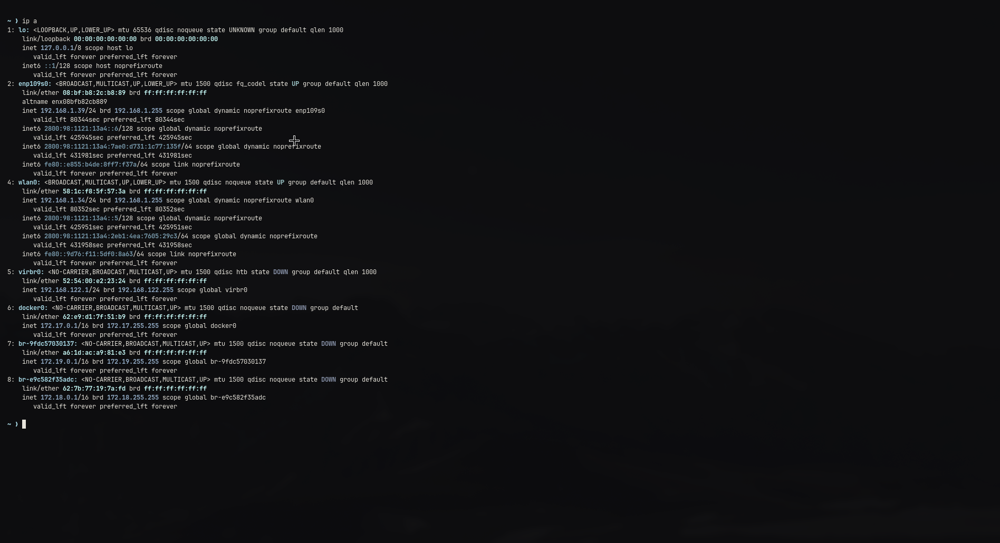

- **lo**: interfaz de loopback (`127.0.0.1/8`, `::1/128`), usada para tráfico local de la propia máquina, estado `UNKNOWN` (normal en loopback) pero `UP`.
- **enp109s0**: interfaz Ethernet física (nomenclatura *predictable network interface names* de systemd: `en`=Ethernet, `p109`=bus PCI, `s0`=slot). Estado `UP,LOWER_UP` (enlace físico activo), MTU 1500, con IP `192.168.1.39/24` asignada por DHCP (`dynamic`) y varias direcciones IPv6 (global y link-local `fe80::`).
- **wlan0**: interfaz inalámbrica, también `UP`, con IP `192.168.1.34/24` y direcciones IPv6 análogas a la anterior.
- **virbr0, docker0, br-9fdc57030137, br-e9c582f35adc**: bridges virtuales creados por `libvirt` (virtualización KVM) y Docker, en estado `DOWN`/`NO-CARRIER` porque no tienen tráfico ni contenedores/VMs activos en este momento. Cada uno tiene su propia subred privada (`192.168.122.0/24`, `172.17-19.0.0/16`).

Se identifican dos interfaces "reales" con conexión a la red física/inalámbrica (`enp109s0`, `wlan0`) y varias interfaces virtuales de software que no participan en la captura de tráfico externo.

### Configuración del ring buffer

En `Captura -> Opciones -> Salida` se configuró:
- Archivo: `lab1_23016` (formato `pcapng`)
- Crear un nuevo archivo automáticamente después de `5` megabytes
- Usar un buffer cíclico con `10` archivos

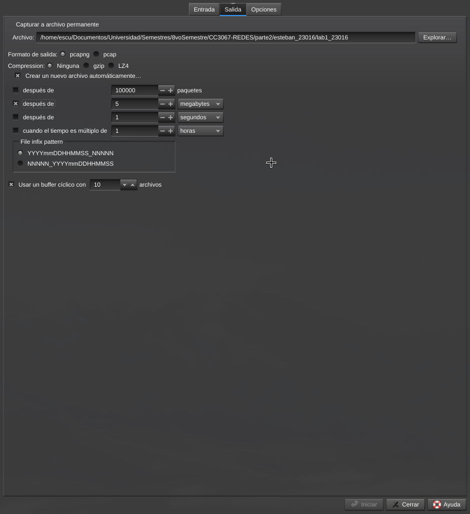

### Captura en progreso

Se inició la captura sobre la interfaz `enp109s0`, generando tráfico de red hasta acumular varios archivos.

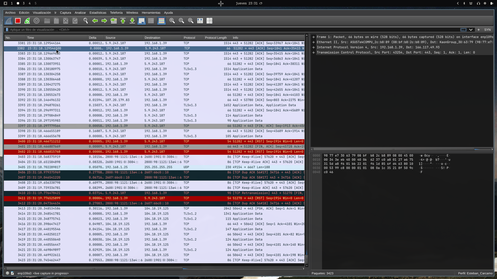

### Archivos generados

Al detener la captura se generaron 10 archivos de ~5 MB cada uno (`lab1_23016_20260709233049_00005` a `..._00014`). La numeración iniciando en `00005` (en vez de `00001`) confirma que el buffer cíclico funcionó correctamente, sobrescribiendo/descartando los archivos más antiguos y conservando únicamente los últimos 10.

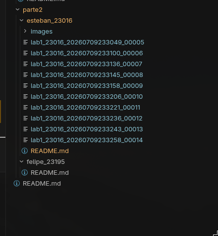

## 3.6 Análisis de paquetes (HTTP)

Se capturó tráfico (sin filtro) al acceder a `http://gaia.cs.umass.edu/wireshark-labs/INTRO-wireshark-file1.html`, y luego se aplicó el filtro de visualización `http` para aislar la petición y respuesta HTTP.

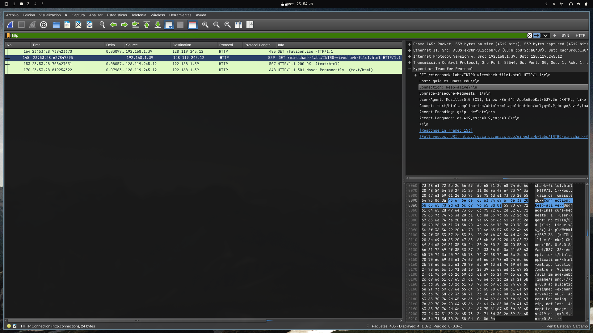
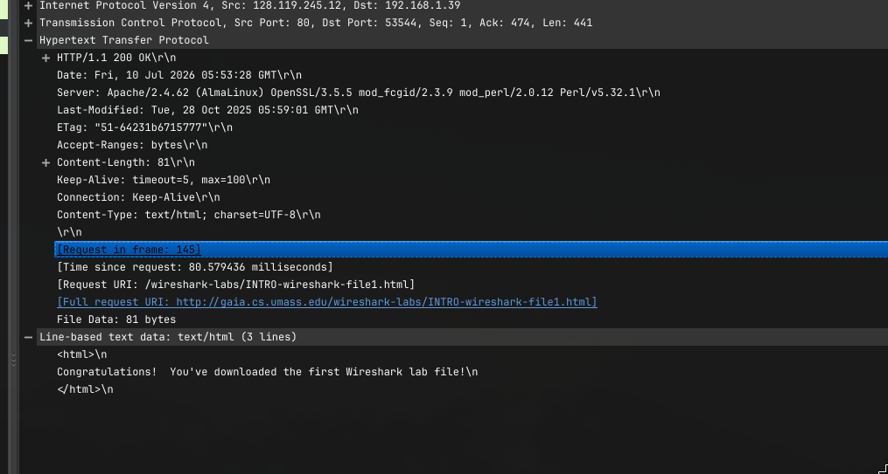

**a. ¿Qué versión de HTTP está ejecutando su navegador?**
`HTTP/1.1` (visible en la línea `GET /wireshark-labs/INTRO-wireshark-file1.html HTTP/1.1`).

**b. ¿Qué versión de HTTP está ejecutando el servidor?**
`HTTP/1.1` (línea `HTTP/1.1 200 OK` de la respuesta). El servidor se identifica como `Apache/2.4.62 (AlmaLinux) OpenSSL/3.5.5 mod_fcgid/2.3.9 mod_perl/2.0.12 Perl/v5.32.1`.

**c. ¿Qué lenguajes indica el navegador que acepta?**
Según el encabezado `Accept-Language: es-419,es;q=0.9,en;q=0.8` del request: español (es-419 y es, con prioridad más alta) e inglés (en, como alternativa de menor prioridad).

**d. ¿Cuántos bytes de contenido fueron devueltos por el servidor?**
`81` bytes (encabezado `Content-Length: 81` de la respuesta), correspondientes al archivo HTML de 3 líneas devuelto.

**e. ¿En qué elementos de la red convendría "escuchar" los paquetes ante un problema de rendimiento? ¿Es conveniente instalar Wireshark en el servidor?**
Ante un problema de rendimiento conviene "escuchar" en varios puntos de la ruta: en el cliente (para medir latencia percibida y tiempos de DNS/TCP/TLS), en el borde de la red del cliente (router/gateway, para descartar congestión local), y en puntos intermedios de tránsito si se sospecha de un ISP o enlace específico. No es conveniente instalar Wireshark directamente en el servidor de producción, ya que: (1) puede consumir recursos de CPU/memoria y afectar el propio rendimiento que se busca medir (efecto observador), (2) en entornos productivos no siempre se tiene acceso administrativo, y (3) el servidor puede recibir tráfico de múltiples clientes, dificultando aislar el problema de un solo flujo. Es preferible capturar cerca del cliente afectado o usar un puerto espejo (SPAN)/TAP de red en un punto intermedio para no impactar el servidor.

## Discusión

**Sobre la personalización del entorno (3.4):** Configurar un perfil separado resultó útil para no alterar los ajustes por defecto y tener un entorno reproducible identificado con mi nombre. Agregar una columna personalizada basada en `frame.len` mostró que, para la mayoría de paquetes de esta traza, la longitud del frame coincide con la columna `Length` por defecto, ya que ambas derivan del mismo campo; la diferencia real se nota en tramas fragmentadas o con reensamblado de TCP. Las reglas de coloreado y los botones de filtro rápido demostraron ser herramientas prácticas para identificar visualmente eventos específicos (como el three-way handshake de TCP) sin tener que teclear el filtro cada vez. Ocultar interfaces virtuales (Docker, libvirt, bridges) simplificó bastante la pantalla de captura, ya que en un sistema con contenedores y virtualización activa el listado por defecto resulta ruidoso e innecesario para el análisis de red física.

**Sobre el ring buffer (3.5):** La salida de `ip a` permitió distinguir claramente las interfaces con conexión real a la red (`enp109s0`, `wlan0`) de las interfaces virtuales creadas por software de virtualización/contenedores, que no participan en el tráfico externo pero sí aparecen en el sistema. Al configurar el buffer cíclico, un error inicial fue confundir la unidad de tamaño (se escribió `5000` en vez de `5` megabytes), lo que hubiera generado archivos de ~5 GB en lugar de 5 MB — un recordatorio de revisar tanto el valor como la unidad al configurar límites de captura. Una vez corregido, el comportamiento del buffer cíclico fue el esperado: al generar tráfico continuo, Wireshark fue creando archivos secuenciales y, al superar el límite de 10, comenzó a descartar los más antiguos, lo cual se evidenció porque los archivos finales conservados iniciaban en el índice `00005` en lugar de `00001`.

**Sobre el análisis HTTP (3.6):** Capturar sin filtro y luego aplicar el filtro de visualización `http` fue mucho más práctico que intentar identificar manualmente los paquetes relevantes entre el resto del tráfico (DNS, TLS de otras pestañas, tráfico en segundo plano de otras aplicaciones). Se confirmó que tanto el navegador como el servidor (`Apache/2.4.62`) utilizan HTTP/1.1, y que examinar los encabezados de la petición y la respuesta (`Accept-Language`, `Content-Length`) permite responder preguntas concretas sobre el intercambio sin necesidad de herramientas adicionales. Esta actividad ayudó a entender de forma práctica por qué Wireshark es valioso tanto para depurar problemas de rendimiento como para auditar qué información expone un navegador a un servidor en cada petición (idioma, user-agent, etc.).

## Conclusiones

- Wireshark ofrece un nivel de personalización considerable (perfiles, columnas, colores, layouts, filtros guardados) que permite adaptar el analizador al flujo de trabajo de cada usuario y facilitar el análisis repetido de ciertos patrones de tráfico, como el establecimiento de conexiones TCP.
- La configuración de captura con buffer cíclico es esencial en escenarios de monitoreo prolongado, ya que evita que los archivos de captura crezcan indefinidamente y agoten el espacio en disco, a costa de perder los datos más antiguos una vez alcanzado el número máximo de archivos.
- El análisis de una simple petición HTTP deja ver la cantidad de metadatos que viajan en cada transacción web (versión de protocolo, idiomas aceptados, tipo de contenido, servidor y tecnologías usadas), información valiosa tanto para diagnóstico de rendimiento como para análisis de seguridad.
- Entender las diferencias entre interfaces de red físicas y virtuales (Ethernet/WiFi vs. bridges de Docker/libvirt/loopback) es importante para evitar capturar tráfico irrelevante y enfocar el análisis en el tráfico que realmente sale hacia la red externa.

## Referencias

- Documentación oficial de Wireshark: https://www.wireshark.org/docs/
- Wireshark User's Guide - Coloring Rules: https://www.wireshark.org/docs/wsug_html_chunked/ChCustColorizationSection.html
- Wireshark User's Guide - Capture Options (ring buffer): https://www.wireshark.org/docs/wsug_html_chunked/ChCapCaptureFiles.html
- man ip(8) / man ifconfig(8) - documentación de comandos de red en Linux
- Wireshark Lab del curso: http://gaia.cs.umass.edu/wireshark-labs/INTRO-wireshark-file1.html
- Guía de laboratorio CC3067 - Esquemas de comunicación e introducción a Wireshark, UVG, Semestre II - 2026
